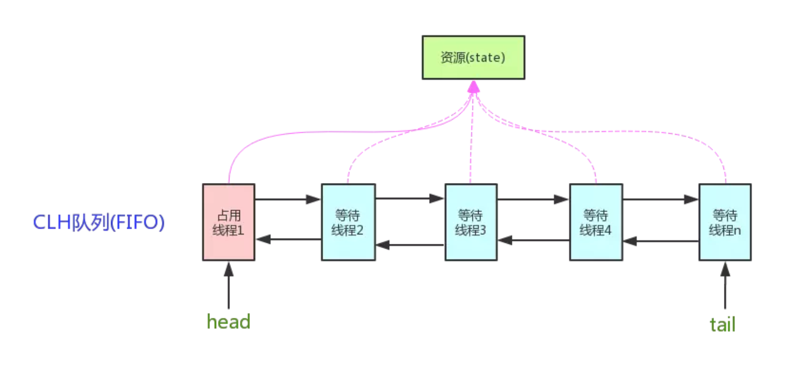

# 第十一章 AQS

## 11.1 AQS简介

**AQS**是`AbstractQueuedSynchronizer`的简称，即`抽象队列同步器`，从字面意思上理解:

- 抽象：抽象类，只实现一些主要逻辑，有些方法由子类实现；
- 队列：使用先进先出（FIFO）队列存储数据；
- 同步：实现了同步的功能。

那AQS有什么用呢？AQS是一个用来构建锁和同步器的框架，使用AQS能简单且高效地构造出应用广泛的同步器，比如我们提到的ReentrantLock，Semaphore，ReentrantReadWriteLock，SynchronousQueue，FutureTask等等皆是基于AQS的。

当然，我们自己也能利用AQS非常轻松容易地构造出符合我们自己需求的同步器，只要之类实现它的几个`protected`方法就可以了，在下文会有详细的介绍。

## 11.2 AQS的数据结构

AQS内部使用了一个volatile的变量state来作为资源的标识。同时定义了几个获取和改版state的protected方法，子类可以覆盖这些方法来实现自己的逻辑：

```java
getState()
setState()
compareAndSetState()
```

这三种叫做均是原子操作，其中compareAndSetState的实现依赖于Unsafe的compareAndSwapInt()方法。

而AQS类本身实现的是一些排队和阻塞的机制，比如具体线程等待队列的维护（如获取资源失败入队/唤醒出队等）。它内部使用了一个先进先出（FIFO）的双端队列。并使用了两个指针head和tail用于标识队列的头部和尾部。其数据结构如图：



## 11.3 资源共享模式

资源有两种共享模式，或者说两种同步方式：

- 独占模式（Exclusive）：资源是独占的，一次只能一个线程获取。如ReentrantLock。
- 共享模式（Share）：同时可以被多个线程获取，具体的资源个数可以通过参数指定。如Semaphore/CountDownLatch。

一般情况下，子类只需要根据需求实现其中一种模式，当然也有同时实现两种模式的同步类，如`ReadWriteLock`。

AQS中关于这两种资源共享模式的定义源码（均在内部类Node中）。我们来看看Node的结构：

```java
static final class Node {
    // 标记一个结点（对应的线程）在共享模式下等待
    static final Node SHARED = new Node();
    // 标记一个结点（对应的线程）在独占模式下等待
    static final Node EXCLUSIVE = null; 

    // waitStatus的值，表示该结点（对应的线程）已被取消
    static final int CANCELLED = 1; 
    // waitStatus的值，表示后继结点（对应的线程）需要被唤醒
    static final int SIGNAL = -1;
    // waitStatus的值，表示该结点（对应的线程）在等待某一条件
    static final int CONDITION = -2;
    /*waitStatus的值，表示有资源可用，新head结点需要继续唤醒后继结点（共享模式下，多线程并发释放资源，而head唤醒其后继结点后，需要把多出来的资源留给后面的结点；设置新的head结点时，会继续唤醒其后继结点）*/
    static final int PROPAGATE = -3;

    // 等待状态，取值范围，-3，-2，-1，0，1
    volatile int waitStatus;
    volatile Node prev; // 前驱结点
    volatile Node next; // 后继结点
    volatile Thread thread; // 结点对应的线程
    Node nextWaiter; // 等待队列里下一个等待条件的结点

    
    // 判断共享模式的方法
    final boolean isShared() {
        return nextWaiter == SHARED;
    }
    
    Node(Thread thread, Node mode) {     // Used by addWaiter
        this.nextWaiter = mode;
        this.thread = thread;
    }
    
    // 其它方法忽略，可以参考具体的源码
}

// AQS里面的addWaiter私有方法
private Node addWaiter(Node mode) {
    // 使用了Node的这个构造函数
    Node node = new Node(Thread.currentThread(), mode);
    // 其它代码省略
}
```

## 11.4 AQS的主要方法源码解析

AQS的设计是基于**模板方法模式**的，它有一些方法必须要子类去实现的，它们主要有：

- isHeldExclusively()：该线程是否正在独占资源。只有用到condition才需要去实现它。

- tryAcquire(int)：独占方式。尝试获取资源，成功则返回true，失败则返回false。

- tryRelease(int)：独占方式。尝试释放资源，成功则返回true，失败则返回false。

- tryAcquireShared(int)：共享方式。尝试获取资源。负数表示失败；0表示成功，但没有剩余可用资源；正数表示成功，且有剩余资源。

- tryReleaseShared(int)：共享方式。尝试释放资源，如果释放后允许唤醒后续等待结点返回true，否则返回false。

这些方法虽然都是`protected`方法，但是它们并没有在AQS具体实现，而是直接抛出异常（虽然不知道这里为什么不使用抽象方法的实现方式）：

```java
protected boolean tryAcquire(int arg) {
    throw new UnsupportedOperationException();
}
```

而AQS实现了一系列主要的逻辑。下面我们从源码来分析一下获取和释放资源的主要逻辑：

### 11.4.1 获取资源

获取资源的入口是acquire(int arg)方法。arg是要获取的资源的个数，在独占模式下始终为1。我们先来看看这个方法的逻辑：

```java
public final void acquire(int arg) {
    if (!tryAcquire(arg) &&
        acquireQueued(addWaiter(Node.EXCLUSIVE), arg))
        selfInterrupt();
}
```

首先调用tryAcquire(arg)尝试去获取资源。前面提到了这个方法是在子类具体实现的。

如果获取资源失败，就通过addWaiter(Node.EXCLUSIVE)方法把这个线程插入到等待队列中。其中传入的参数代表要插入的Node是独占式的。这个方法的具体实现：

```java
private Node addWaiter(Node mode) {
    // 生成该线程对应的Node节点
    Node node = new Node(Thread.currentThread(), mode);
    // 将Node插入队列中
    Node pred = tail;
    if (pred != null) {
        node.prev = pred;
        // 使用CAS尝试，如果成功就返回
        if (compareAndSetTail(pred, node)) {
            pred.next = node;
            return node;
        }
    }
    // 如果等待队列为空或者上述CAS失败，再自旋CAS插入
    enq(node);
    return node;
}

// 自旋CAS插入等待队列
private Node enq(final Node node) {
    for (;;) {
        Node t = tail;
        if (t == null) { // Must initialize
            if (compareAndSetHead(new Node()))
                tail = head;
        } else {
            node.prev = t;
            if (compareAndSetTail(t, node)) {
                t.next = node;
                return t;
            }
        }
    }
}
```

> 上面的两个函数比较好理解，就是在队列的尾部插入新的Node节点，但是需要注意的是由于AQS中会存在多个线程同时争夺资源的情况，因此肯定会出现多个线程同时插入节点的操作，在这里是通过CAS自旋的方式保证了操作的线程安全性。

OK，现在回到最开始的aquire(int arg)方法。现在通过addWaiter方法，已经把一个Node放到等待队列尾部了。而处于等待队列的结点是从头结点一个一个去获取资源的。具体的实现我们来看看acquireQueued方法

```java
final boolean acquireQueued(final Node node, int arg) {
    boolean failed = true;
    try {
        boolean interrupted = false;
        // 自旋
        for (;;) {
            final Node p = node.predecessor();
            // 如果node的前驱结点p是head，表示node是第二个结点，就可以尝试去获取资源了
            if (p == head && tryAcquire(arg)) {
                // 拿到资源后，将head指向该结点。
                // 所以head所指的结点，就是当前获取到资源的那个结点或null。
                setHead(node); 
                p.next = null; // help GC
                failed = false;
                return interrupted;
            }
            // 如果自己可以休息了，就进入waiting状态，直到被unpark()
            if (shouldParkAfterFailedAcquire(p, node) &&
                parkAndCheckInterrupt())
                interrupted = true;
        }
    } finally {
        if (failed)
            cancelAcquire(node);
    }
}
```

> 这里parkAndCheckInterrupt方法内部使用到了LockSupport.park(this)，顺便简单介绍一下park。
>
> LockSupport类是Java 6 引入的一个类，提供了基本的线程同步原语。LockSupport实际上是调用了Unsafe类里的函数，归结到Unsafe里，只有两个函数：
>
> -  park(boolean isAbsolute, long time)：阻塞当前线程
> - unpark(Thread jthread)：使给定的线程停止阻塞

所以**结点进入等待队列后，是调用park使它进入阻塞状态的。只有头结点的线程是处于活跃状态的**。

当然，获取资源的方法除了acquire外，还有以下三个：

- acquireInterruptibly：申请可中断的资源（独占模式）
- acquireShared：申请共享模式的资源
- acquireSharedInterruptibly：申请可中断的资源（共享模式）

> 可中断的意思是，在线程中断时可能会抛出`InterruptedException`

总结起来的一个流程图：


## 11.4.2 释放资源

释放资源相比于获取资源来说，会简单许多。在AQS中只有一小段实现。源码：

```java
public final boolean release(int arg) {
    if (tryRelease(arg)) {
        Node h = head;
        if (h != null && h.waitStatus != 0)
            unparkSuccessor(h);
        return true;
    }
    return false;
}

private void unparkSuccessor(Node node) {
    // 如果状态是负数，尝试把它设置为0
    int ws = node.waitStatus;
    if (ws < 0)
        compareAndSetWaitStatus(node, ws, 0);
    // 得到头结点的后继结点head.next
    Node s = node.next;
    // 如果这个后继结点为空或者状态大于0
    // 通过前面的定义我们知道，大于0只有一种可能，就是这个结点已被取消
    if (s == null || s.waitStatus > 0) {
        s = null;
        // 等待队列中所有还有用的结点，都向前移动
        for (Node t = tail; t != null && t != node; t = t.prev)
            if (t.waitStatus <= 0)
                s = t;
    }
    // 如果后继结点不为空，
    if (s != null)
        LockSupport.unpark(s.thread);
}
```

---

**参考资料**

- [Java技术之AQS详解](https://www.jianshu.com/p/da9d051dcc3d)
- [JDK源码之AQS源码剖析](https://www.cnblogs.com/showing/p/6858410.html)
- [JUC解析-AQS(1)](https://juejin.im/post/5ab92f50518825558949d1a6)
