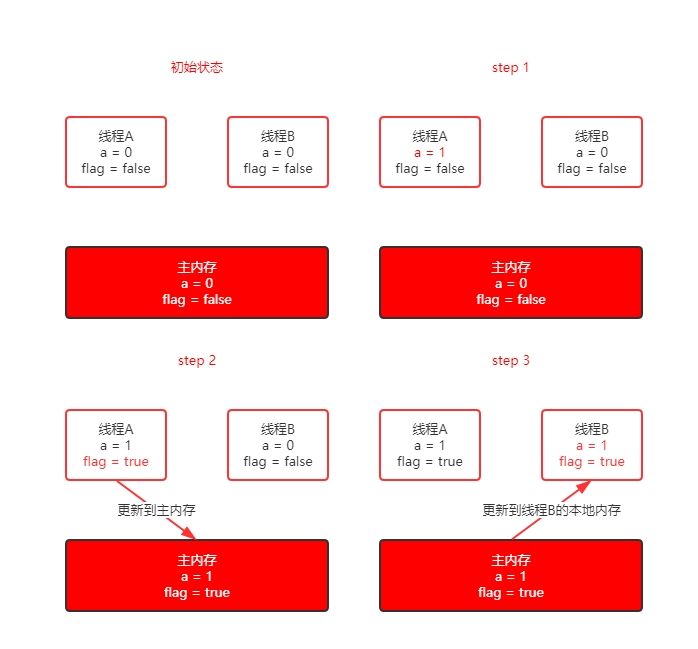
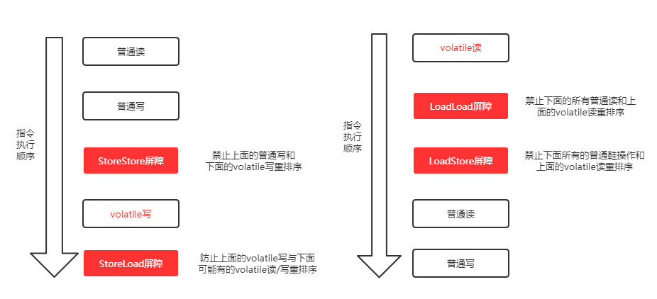

# 第八章 volatile

## 8.1 几个基本概念

在介绍volatile之前，我们先回顾及介绍几个基本的概念。

### 8.1.1 内存可见性

在Java内存模型那一章我们介绍了JMM有一个主内存，每个线程有自己私有的工作内存，工作内存中保存了一些变量在主内存的拷贝。

**内存可见性，指的是线程之间的可见性，当一个线程修改了共享变量时，另一个线程可以读取到这个修改后的值**。

### 8.1.2 重排序

为优化程序性能，对原有的指令执行顺序进行优化重新排序。重排序可能发生在多个阶段，比如编译重排序、CPU重排序等。

### 8.1.3 happens-before规则

是一个给程序员使用的规则，只要程序员在写代码的时候遵循happens-before规则，JVM就能保证指令在多线程之间的顺序性符合程序员的预期。

## 8.2 volatile的内存语义

在Java中，volatile关键字有特殊的内存语义。volatile主要有以下两个功能：

- 保证变量的**内存可见性**
- 禁止volatile变量与普通变量**重排序**（JSR133提出，Java 5 开始才有这个“增强的volatile内存语义”）

### 8.2.1 内存可见性

以一段示例代码开始：

```java
public class VolatileExample {
    int a = 0;
    volatile boolean flag = false;
    
    public void writer() {
        a = 1; // step 1
        flag = true; // step 2
    }
    
    public void reader() {
        if (flag) { // step 3
            System.out.println(a); // step 4
        }
    }
}
```

在这段代码里，我们使用`volatile`关键字修饰了一个`boolean`类型的变量`flag`。

所谓内存可见性，指的是当一个线程对`volatile`修饰的变量进行**写操作**（比如step 2）时，JMM会立即把该线程对应的本地内存中的共享变量的值刷新到主内存；当一个线程对`volatile`修饰的变量进行**读操作**（比如step 3）时，JMM会把立即该线程对应的本地内存置为无效，从主内存中读取共享变量的值。

> 在这一点上，volatile与锁具有相同的内存效果，volatile变量的写和锁的释放具有相同的内存语义，volatile变量的读和锁的获取具有相同的内存语义。

假设在时间线上，线程A先执行方法`writer`方法，线程B后执行`reader`方法。那必然会有下图：



而如果`flag`变量**没有**用`volatile`修饰，在step 2，线程A的本地内存里面的变量就不会立即更新到主内存，那随后线程B也同样不会去主内存拿最新的值，仍然使用线程B本地内存缓存的变量的值`a = 0，flag = false`。

### 8.2.1 禁止重排序

在JSR-133之前的旧的Java内存模型中，是允许volatile变量与普通变量重排序的。那上面的案例中，可能就会被重排序成下列时序来执行：

1. 线程A写volatile变量，step 2，设置flag为true；
2. 线程B读同一个volatile，step 3，读取到flag为true；
3. 线程B读普通变量，step 4，读取到 a = 0；
4. 线程A修改普通变量，step 1，设置 a = 1；

可见，如果volatile变量与普通变量发生了重排序，虽然volatile变量能保证内存可见性，也可能导致普通变量读取错误。

所以在旧的内存模型中，volatile的写-读就不能与锁的释放-获取具有相同的内存语义了。为了提供一种比锁更轻量级的**线程间的通信机制**，**JSR-133**专家组决定增强volatile的内存语义：严格限制编译器和处理器对volatile变量与普通变量的重排序。

编译器还好说，JVM是怎么还能限制处理器的重排序的呢？它是通过**内存屏障**来实现的。

什么是内存屏障？硬件层面，内存屏障分两种：读屏障（Load Barrier）和写屏障（Store Barrier）。内存屏障有两个作用：

1. 阻止屏障两侧的指令重排序；
2. 强制把写缓冲区/高速缓存中的脏数据等写回主内存，或者让缓存中相应的数据失效。

> 注意这里的缓存主要指的是CPU缓存，如L1，L2等

编译器在**生成字节码时**，会在指令序列中插入内存屏障来禁止特定类型的处理器重排序。编译器选择了一个**比较保守的JMM内存屏障插入策略**，这样可以保证在任何处理器平台，任何程序中都能得到正确的volatile内存语义。这个策略是：

- 在每个volatile写操作前插入一个StoreStore屏障；
- 在每个volatile写操作后插入一个StoreLoad屏障；
- 在每个volatile读操作后插入一个LoadLoad屏障；
- 在每个volatile读操作后再插入一个LoadStore屏障。

大概示意图是这个样子：



> 再逐个解释一下这几个屏障。注：下述Load代表读操作，Store代表写操作
>
> **LoadLoad屏障**：对于这样的语句Load1; LoadLoad; Load2，在Load2及后续读取操作要读取的数据被访问前，保证Load1要读取的数据被读取完毕。  
> **StoreStore屏障**：对于这样的语句Store1; StoreStore; Store2，在Store2及后续写入操作执行前，这个屏障会吧Store1强制刷新到内存，保证Store1的写入操作对其它处理器可见。  
> **LoadStore屏障**：对于这样的语句Load1; LoadStore; Store2，在Store2及后续写入操作被刷出前，保证Load1要读取的数据被读取完毕。  
> **StoreLoad屏障**：对于这样的语句Store1; StoreLoad; Load2，在Load2及后续所有读取操作执行前，保证Store1的写入对所有处理器可见。它的开销是四种屏障中最大的（冲刷写缓冲器，清空无效化队列）。在大多数处理器的实现中，这个屏障是个万能屏障，兼具其它三种内存屏障的功能

对于连续多个volatile变量读或者连续多个volatile变量写，编译器做了一定的优化来提高性能，比如：

> 第一个volatile读;  
>
> LoadLoad屏障；  
>
> 第二个volatile读；  
>
> LoadStore屏障

再介绍一下volatile与普通变量的重排序规则:

1. 如果第一个操作是volatile读，那无论第二个操作是什么，都不能重排序；

2. 如果第二个操作是volatile写，那无论第一个操作是什么，都不能重排序；

3. 如果第一个操作是volatile写，第二个操作是volatile读，那不能重排序。

举个例子，我们在案例中step 1，是普通变量的写，step 2是volatile变量的写，那符合第2个规则，这两个steps不能重排序。而step 3是volatile变量读，step 4是普通变量读，符合第1个规则，同样不能重排序。

但如果是下列情况：第一个操作是普通变量读，第二个操作是volatile变量读，那是可以重排序的：

```java
// 声明变量
int a = 0; // 声明普通变量
volatile boolean flag = false; // 声明volatile变量

// 以下两个变量的读操作是可以重排序的
int i = a; // 普通变量读
boolean j = flag; // volatile变量读
```


## 8.3 volatile的用途

从volatile的内存语义上来看，volatile可以保证内存可见性且禁止重排序。

在保证内存可见性这一点上，volatile有着与锁相同的内存语义，所以可以作为一个“轻量级”的锁来使用。但由于volatile仅仅保证对单个volatile变量的读/写具有原子性，而锁可以保证整个**临界区代码**的执行具有原子性。所以**在功能上，锁比volatile更强大；在性能上，volatile更有优势**。

在禁止重排序这一点上，volatile也是非常有用的。比如我们熟悉的单例模式，其中有一种实现方式是“双重锁检查”，比如这样的代码：

```java
public class Singleton {

    private static Singleton instance; // 不使用volatile关键字
    
    // 双重锁检验
    public static Singleton getInstance() {
        if (instance == null) { // 第7行
            synchronized (Singleton.class) {
                if (instance == null) {
                    instance = new Singleton(); // 第10行
                }
            }
        }
        return instance;
    }
}
```

如果这里的变量声明不使用volatile关键字，是可能会发生错误的。它可能会被重排序：

```java
instance = new Singleton(); // 第10行

// 可以分解为以下三个步骤
1 memory=allocate();// 分配内存 相当于c的malloc
2 ctorInstanc(memory) //初始化对象
3 s=memory //设置s指向刚分配的地址

// 上述三个步骤可能会被重排序为 1-3-2，也就是：
1 memory=allocate();// 分配内存 相当于c的malloc
3 s=memory //设置s指向刚分配的地址
2 ctorInstanc(memory) //初始化对象
```

而一旦假设发生了这样的重排序，比如线程A在第10行执行了步骤1和步骤3，但是步骤2还没有执行完。这个时候另一个线程B执行到了第7行，它会判定instance不为空，然后直接返回了一个未初始化完成的instance！

所以JSR-133对volatile做了增强后，volatile的禁止重排序功能还是非常有用的。

---

**参考资料**

* [happens-before规则和as-if-serial语义](https://blog.csdn.net/u010571316/article/details/64906481)
* [volatile关键字详解](https://blog.csdn.net/kg_2012/article/details/79059909)
* [Java可见性机制的原理](https://www.cnblogs.com/humc/p/5426351.html)
* [Volatile关键字介绍](https://blog.csdn.net/summerZBH123/article/details/80547516)
* [Java中Volatile关键字详解](https://www.cnblogs.com/zhengbin/p/5654805.html)
* [JVM(十一)Java指令重排序](https://blog.csdn.net/yjp198713/article/details/78839698)
* [深入理解JVM（二）——内存模型、可见性、指令重排序](https://www.cnblogs.com/leefreeman/p/7356030.html)
* [JMM-volatile与内存屏障](https://blog.csdn.net/hqq2023623/article/details/51013468)
* [并发关键字volatile（重排序和内存屏障）](https://www.jianshu.com/p/ef8de88b1343)
