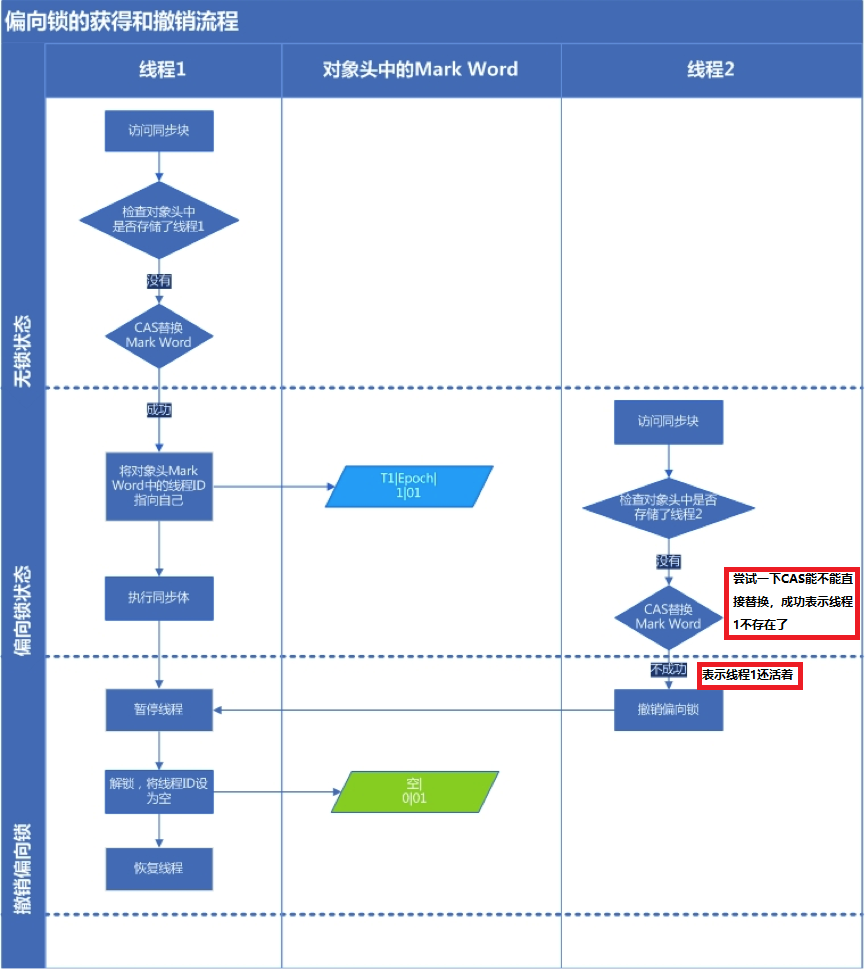

# 第九章 synchronized与锁

这篇文章我们来聊一聊Java多线程里面的“锁”。

首先需要明确的一点是：**Java多线程的锁都是基于对象的**，Java中的每一个对象都可以作为一个锁。

还有一点需要注意的是，我们常听到的**类锁**其实也是对象锁。

 Java类只有一个Class对象（可以有多个实例对象，多个实例共享这个Class对象），而Class对象也是特殊的Java对象。所以我们常说的类锁，其实就是Class对象的锁。

## 9.1 Synchronized关键字

说到锁，我们通常会谈到`synchronized`这个关键字。它翻译成中文就是“同步”的意思。

我们通常使用`synchronized`关键字来给一段代码或一个方法上锁。它通常有以下三种形式：

```java
// 关键字在实例方法上，锁为当前实例
public synchronized void instanceLock() {
    // code
}

// 关键字在静态方法上，锁为当前Class对象
public static synchronized void classLock() {
    // code
}

// 关键字在代码块上，锁为括号里面的对象
public void blockLock() {
    Object o = new Object();
    synchronized (o) {
        // code
    }
}
```

我们这里介绍一下“临界区”的概念。所谓“临界区”，指的是某一块代码区域，它同一时刻只能由一个线程执行。在上面的例子中，如果`synchronized`关键字在方法上，那临界区就是整个方法内部。而如果是使用synchronized代码块，那临界区就指的是代码块内部的区域。

通过上面的例子我们可以看到，下面这两个写法其实是等价的作用：

```java
// 关键字在实例方法上，锁为当前实例
public synchronized void instanceLock() {
    // code
}

// 关键字在代码块上，锁为括号里面的对象
public void blockLock() {
    synchronized (this) {
        // code
    }
}
```

同理，下面这两个方法也应该是等价的：

```java
// 关键字在静态方法上，锁为当前Class对象
public static synchronized void classLock() {
    // code
}

// 关键字在代码块上，锁为括号里面的对象
public void blockLock() {
    synchronized (this.getClass()) {
        // code
    }
}
```

## 9.2 几种锁

Java 6 为了减少获得锁和释放锁带来的性能消耗，引入了“偏向锁”和“轻量级锁“。在Java 6 以前，所有的锁都是”重量级“锁。所以在Java 6 及其以后，一个对象其实有四种锁状态，它们级别由低到高依次是：

1. 无锁状态
2. 偏向锁状态
3. 轻量级锁状态
4. 重量级锁状态

无锁就是没有对资源进行锁定，任何线程都可以尝试去修改它，无锁在这里不再细讲。

几种锁会随着竞争情况逐渐升级，锁的升级很容易发生，但是锁降级发生的条件会比较苛刻，锁降级发生在Stop The World期间，当JVM进入安全点的时候，会检查是否有闲置的锁，然后进行降级。

> 关于锁降级有两点说明：
>
> 1.不同于大部分文章说锁不能降级，实际上HotSpot JVM 是支持锁降级的，文末有链接。
>
> 2.上面提到的Stop The World期间，以及安全点，这些知识是属于JVM的知识范畴，本文不做细讲。

下面分别介绍这几种锁以及它们之间的升级。

### 9.2.1 Java对象头

前面我们提到，Java的锁都是基于对象的。首先我们来看看一个对象的“锁”的信息是存放在什么地方的。

每个Java对象都有对象头。如果是非数组类型，则用2个字宽来存储对象头，如果是数组，则会用3个字宽来存储对象头。在32位处理器中，一个字宽是32位；在64位虚拟机中，一个字宽是64位。对象头的内容如下表：

| 长度     | 内容                   | 说明                         |
| -------- | ---------------------- | ---------------------------- |
| 32/64bit | Mark Word              | 存储对象的hashCode或锁信息等 |
| 32/64bit | Class Metadata Address | 存储到对象类型数据的指针     |
| 32/64bit | Array length           | 数组的长度（如果是数组）     |

我们主要来看看Mark Word的格式：

| 锁状态   | 29 bit 或 61 bit             | 1 bit 是否是偏向锁？       | 2 bit 锁标志位 |
| -------- | ---------------------------- | -------------------------- | -------------- |
| 无锁     |                              | 0                          | 01             |
| 偏向锁   | 线程ID                       | 1                          | 01             |
| 轻量级锁 | 指向栈中锁记录的指针         | 此时这一位不用于标识偏向锁 | 00             |
| 重量级锁 | 指向互斥量（重量级锁）的指针 | 此时这一位不用于标识偏向锁 | 10             |
| GC标记   |                              | 此时这一位不用于标识偏向锁 | 11             |

可以看到，当对象状态为偏向锁时，`Mark Word`存储的是偏向的线程ID；当状态为轻量级锁时，`Mark Word`存储的是指向线程栈中`Lock Record`的指针；当状态为重量级锁时，`Mark Word`为指向堆中的monitor对象的指针。

### 9.2.2 偏向锁

Hotspot的作者经过以往的研究发现大多数情况下**锁不仅不存在多线程竞争，而且总是由同一线程多次获得**，于是引入了偏向锁。

偏向锁会偏向于第一个访问锁的线程，如果在接下来的运行过程中，该锁没有被其他的线程访问，则持有偏向锁的线程将永远不需要触发同步。也就是说，**偏向锁在资源无竞争情况下消除了同步语句，连CAS操作都不做了，提高了程序的运行性能。**

> 大白话就是对锁置个变量，如果发现为true，代表资源无竞争，则无需再走各种加锁/解锁流程。如果为false，代表存在其他线程竞争资源，那么就会走后面的流程。

#### **实现原理**

一个线程在第一次进入同步块时，会在对象头和栈帧中的锁记录里存储锁的偏向的线程ID。当下次该线程进入这个同步块时，会去检查锁的Mark Word里面是不是放的自己的线程ID。

如果是，表明该线程已经获得了锁，以后该线程在进入和退出同步块时不需要花费CAS操作来加锁和解锁 ；如果不是，就代表有另一个线程来竞争这个偏向锁。这个时候会尝试使用CAS来替换Mark Word里面的线程ID为新线程的ID，这个时候要分两种情况：

- 成功，表示之前的线程不存在了， Mark Word里面的线程ID为新线程的ID，锁不会升级，仍然为偏向锁；
- 失败，表示之前的线程仍然存在，那么暂停之前的线程，设置偏向锁标识为0，并设置锁标志位为00，升级为轻量级锁，会按照轻量级锁的方式进行竞争锁。

> CAS: Compare and Swap
>
> 比较并设置。用于在硬件层面上提供原子性操作。在 Intel 处理器中，比较并交换通过指令cmpxchg实现。
> 比较是否和给定的数值一致，如果一致则修改，不一致则不修改。

线程竞争偏向锁的过程如下：


图中涉及到了lock record指针指向当前堆栈中的最近一个lock record，是轻量级锁按照先来先服务的模式进行了轻量级锁的加锁。

#### 撤销偏向锁

偏向锁使用了一种**等到竞争出现才释放锁的机制**，所以当其他线程尝试竞争偏向锁时， 持有偏向锁的线程才会释放锁。

偏向锁升级成轻量级锁时，会暂停拥有偏向锁的线程，重置偏向锁标识，这个过程看起来容易，实则开销还是很大的，大概的过程如下：

1. 在一个安全点（在这个时间点上没有字节码正在执行）停止拥有锁的线程。
2. 遍历线程栈，如果存在锁记录的话，需要修复锁记录和Mark Word，使其变成无锁状态。
3. 唤醒被停止的线程，将当前锁升级成轻量级锁。 

所以，如果应用程序里所有的锁通常出于竞争状态，那么偏向锁就会是一种累赘，对于这种情况，我们可以一开始就把偏向锁这个默认功能给关闭：

```java
-XX:UseBiasedLocking=false。
```

下面这个经典的图总结了偏向锁的获得和撤销：



### 9.2.3 轻量级锁

多个线程在不同时段获取同一把锁，即不存在锁竞争的情况，也就没有线程阻塞。针对这种情况，JVM采用轻量级锁来避免线程的阻塞与唤醒。 

#### 轻量级锁的加锁

JVM会为每个线程在当前线程的栈帧中创建用于存储锁记录的空间，我们称为Displaced Mark Word。如果一个线程获得锁的时候发现是轻量级锁，会把锁的Mark Word复制到自己的Displaced Mark Word里面。

然后线程尝试用CAS将锁的Mark Word替换为指向锁记录的指针。如果成功，当前线程获得锁，如果失败，表示Mark Word已经被替换成了其他线程的锁记录，说明在与其它线程竞争锁，当前线程就尝试使用自旋来获取锁。

> 自旋：不断尝试去获取锁，一般用循环来实现。

自旋是需要消耗CPU的，如果一直获取不到锁的话，那该线程就一直处在自旋状态，白白浪费CPU资源。解决这个问题最简单的办法就是指定自旋的次数，例如让其循环10次，如果还没获取到锁就进入阻塞状态。

但是JDK采用了更聪明的方式——适应性自旋，简单来说就是线程如果自旋成功了，则下次自旋的次数会更多，如果自旋失败了，则自旋的次数就会减少。

自旋也不是一直进行下去的，如果自旋到一定程度（和JVM、操作系统相关），依然没有获取到锁，称为自旋失败，那么这个线程会阻塞。同时这个锁就会**升级成重量级锁**。

**轻量级锁的释放：**

在释放锁时，当前线程会使用CAS操作将Displaced Mark Word的内容复制回锁的Mark Word里面。如果没有发生竞争，那么这个复制的操作会成功。如果有其他线程因为自旋多次导致轻量级锁升级成了重量级锁，那么CAS操作会失败，此时会释放锁并唤醒被阻塞的线程。

一张图说明加锁和释放锁的过程：


### 9.2.4 重量级锁

重量级锁依赖于操作系统的互斥量（mutex） 实现的，而操作系统中线程间状态的转换需要相对比较长的时间，所以重量级锁效率很低，但被阻塞的线程不会消耗CPU。

前面说到，每一个对象都可以当做一个锁，当多个线程同时请求某个对象锁时，对象锁会设置几种状态用来区分请求的线程：

```
Contention List：所有请求锁的线程将被首先放置到该竞争队列
Entry List：Contention List中那些有资格成为候选人的线程被移到Entry List
Wait Set：那些调用wait方法被阻塞的线程被放置到Wait Set
OnDeck：任何时刻最多只能有一个线程正在竞争锁，该线程称为OnDeck
Owner：获得锁的线程称为Owner
!Owner：释放锁的线程
```

当一个线程尝试获得锁时，如果该锁已经被占用，则会将该线程封装成一个`ObjectWaiter`对象插入到Contention List的队列的队首，然后调用`park`函数挂起当前线程。

当线程释放锁时，会从Contention List或EntryList中挑选一个线程唤醒，被选中的线程叫做`Heir presumptive`即假定继承人，假定继承人被唤醒后会尝试获得锁，但`synchronized`是非公平的，所以假定继承人不一定能获得锁。这是因为对于重量级锁，线程先自旋尝试获得锁，这样做的目的是为了减少执行操作系统同步操作带来的开销。如果自旋不成功再进入等待队列。这对那些已经在等待队列中的线程来说，稍微显得不公平，还有一个不公平的地方是自旋线程可能会抢占了Ready线程的锁。

果线程获得锁后调用`Object.wait`方法，则会将线程加入到WaitSet中，当被`Object.notify`唤醒后，会将线程从WaitSet移动到Contention List或EntryList中去。需要注意的是，当调用一个锁对象的`wait`或`notify`方法时，**如当前锁的状态是偏向锁或轻量级锁则会先膨胀成重量级锁**。

### 9.2.5 总结锁的升级流程

每一个线程在准备获取共享资源时： 
第一步，检查MarkWord里面是不是放的自己的ThreadId ,如果是，表示当前线程是处于 “偏向锁” 。

第二步，如果MarkWord不是自己的ThreadId，锁升级，这时候，用CAS来执行切换，新的线程根据MarkWord里面现有的ThreadId，通知之前线程暂停，之前线程将Markword的内容置为空。 

第三步，两个线程都把锁对象的HashCode复制到自己新建的用于存储锁的记录空间，接着开始通过CAS操作，
把锁对象的MarKword的内容修改为自己新建的记录空间的地址的方式竞争MarkWord。

第四步，第三步中成功执行CAS的获得资源，失败的则进入自旋 。

第五步，自旋的线程在自旋过程中，成功获得资源(即之前获的资源的线程执行完成并释放了共享资源)，则整个状态依然处于 轻量级锁的状态，如果自旋失败 。

第六步，进入重量级锁的状态，这个时候，自旋的线程进行阻塞，等待之前线程执行完成并唤醒自己。

### 9.2.6 各种锁的优缺点对比

下表来自《Java并发编程的艺术》：

| 锁       | 优点                                                         | 缺点                                             | 适用场景                             |
| -------- | ------------------------------------------------------------ | ------------------------------------------------ | ------------------------------------ |
| 偏向锁   | 加锁和解锁不需要额外的消耗，和执行非同步方法比仅存在纳秒级的差距。 | 如果线程间存在锁竞争，会带来额外的锁撤销的消耗。 | 适用于只有一个线程访问同步块场景。   |
| 轻量级锁 | 竞争的线程不会阻塞，提高了程序的响应速度。                   | 如果始终得不到锁竞争的线程使用自旋会消耗CPU。    | 追求响应时间。同步块执行速度非常快。 |
| 重量级锁 | 线程竞争不使用自旋，不会消耗CPU。                            | 线程阻塞，响应时间缓慢。                         | 追求吞吐量。同步块执行速度较长。     |

---

**参考文章**

* [Java锁优化--JVM锁降级](https://www.jianshu.com/p/9932047a89be)
* [Java中的锁机制](https://www.cnblogs.com/charlesblc/p/5994162.html)
* [死磕Synchronized底层实现](https://github.com/farmerjohngit/myblog/issues/12)
* 《Java并发编程的艺术》

