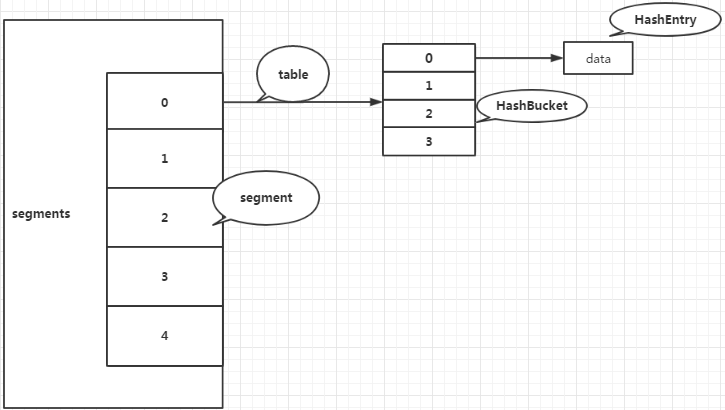

## 同步容器与并发容器
同步容器，我们知道在java.util包下提供了一些容器类，而Vector和HashTable是线程安全的同步类，但是这些容器实现同步的方式是通过对方法加锁(sychronized)方式实现的，这样读写均需要锁操作，导致性能低下；其次即使是Vector这样线程安全的类，在面对多线程下的复合操作的时候也是需要通过客户端加锁的方式保证原子性。如下面例子说明:
```java
public class TestVector {
	private Vector<String> vector;

	//方法一
	public  Object getLast(Vector vector) {
	    int lastIndex = vector.size() - 1;
	    return vector.get(lastIndex);
	}
	
	//方法二
	public  void deleteLast(Vector vector) {
	    int lastIndex = vector.size() - 1;
	    vector.remove(lastIndex);
	}
	
	
	//方法三
	public  Object getLastSysnchronized(Vector vector) {
		synchronized(vector){
			int lastIndex = vector.size() - 1;
			return vector.get(lastIndex);
		}
	}

	//方法四
	public  void deleteLastSysnchronized(Vector vector) {
		synchronized (vector){
			int lastIndex = vector.size() - 1;
			vector.remove(lastIndex);
		}
	}
	
}
```
如果方法一和方法二为一个组合的话。那么当方法一获取到了vector的size之后，方法二已经执行完毕，这样就导致程序的错误。
如果方法三与方法四组合的话。通过锁机制保证了在vector上的操作的原子性。

并发容器是Java 5 提供的在多线程编程下用于代替同步容器，针对不同的应用场景进行设计，提高容器的并发访问性，同时定义了线程安全的复合操作

## 并发容器整体类图架构介绍
整体架构(列举常用的容器类)


如上图所示，主要两个接口
ConcurrentMap:定义了Map的原子操作，用于替代同步队列map,其中常用的有ConcurrentHashMap、ConcurrentSkipListMap实现类
```java

//获取对应key的默认值，如果key不存在则为null
V getOrDefault(Object key, V defaultValue)

//如果传入key对应的value已经存在，就返回存在的value，不进行替换。如果不存在，就添加key和value，返回null
//If the specified key is not already associated with a value, associate it with the given value.
V putIfAbsent(K key, V value);

//根据指定的key和value值删除
//Removes the entry for a key only if currently mapped to a given value.
boolean remove(Object key, Object value);

//根据指定的key和oldValue值进行替换成newValue
//Replaces the entry for a key only if currently mapped to a given value.
boolean replace(K key, V oldValue, V newValue);

//根据指定的key替换value
//Replaces the entry for a key only if currently mapped to some value
V replace(K key, V value);

```
   
BlockingQueue:阻塞队列，不允许null值;取元素时，如果队列为空则等待；存元素时，如果没有空间则等待
```java

//将指定的元素插入到此队列中，如果可以立即执行此操作而不违反容量限制,成功后返回true;如果没有可用的空间，则抛出IllegalStateException
/* 
Inserts the specified element into this queue if it is possible to do so immediately without violating capacity restrictions, returning
{@code true} upon success and throwing an {@code IllegalStateException} if no space is currently available.
*/
boolean add(E e);

//将指定的元素插入到此队列中，如果可以立即执行此操作而不违反容量限制,成功后返回true;如果没有可用的空间，返回false
/*
Inserts the specified element into this queue if it is possible to do so immediately without violating capacity restrictions, returning
{@code true} upon success and {@code false} if no space is currently available. 
*/
boolean offer(E e);

//将指定元素插入此队列中，将等待可用的空间。形成阻塞
//Inserts the specified element into this queue, waiting if necessary for space to become available.
void put(E e) throws InterruptedException;


//如果在指定的时间内，还不能将元素插入队列中，则返回失败。
/*
Inserts the specified element into this queue, waiting up to the specified wait time if necessary for space to become available.
*/
boolean offer(E e, long timeout, TimeUnit unit) throws InterruptedException;

//检索获取队列的第一个元素，如果元素不可获得(队列为空),则阻塞,直到队列中有可得到元素，并获取元素
/*
Retrieves and removes the head of this queue, waiting if necessary until an element becomes available.
*/
 E take() throws InterruptedException;

//检索获取队列里排在首位的对象,若不能立即取出,则可以等time参数规定的时间,取不到时返回null
/*
Retrieves and removes the head of this queue, waiting up to the specified wait time if necessary for an element to become available.
*/
E poll(long timeout, TimeUnit unit) throws InterruptedException;

//返回队列剩余容量大小
/* 
Returns the number of additional elements that this queue can ideally (in the absence of memory or resource constraints) accept without
blocking, or {@code Integer.MAX_VALUE} if there is no intrinsic limit.
*/
int remainingCapacity();


//删除队列中指定的元素
 boolean remove(Object o);

//如果队列中包含指定的元素返回true;反之false
 public boolean contains(Object o);


//一次性从队列中获取所有可用的数据对象存放到指定的集合c中
//Removes all available elements from this queue and adds them to the given collection
int drainTo(Collection<? super E> c);

//一次性从队列中获取指定个数的可用数据对象存放到指定的集合c中
//Removes at most the given number of available elements from  this queue and adds them to the given collection.
 int drainTo(Collection<? super E> c, int maxElements);

```

## 并发容器分类
### CopyOnWrite容器
CopyOnWrite容器：CopyOnWriteArrayList(代替同步List)、CopyOnWriteArraySet(代替同步Set)

CopyOnWrite容器实现原理是，在创建CopyOnWrite容器实例时，是通过安全方式发布了一个事实不可变对象，安全发布的事实不可变对象是线程安全的，那么在访问该对象时就不再需要进一步的同步。

但是在每次修改时，都会创建并重新发布一个新的容器副本，从而实现可变性。
"写入时复制"容器的迭代保留一个指向底层基础数组的引用，这个数组当前位于迭代器的起始位置，并且不会被修改，多线程下对这个容器进行迭代，对其同步只需要保证可见性,在CopyOnWriteArrayList底层数组的定义如下,
```java
    private transient volatile Object[] array;
```
需要注意的时，每当修改容器是都会复制底层数组，这需要一定的开销，特别是当容器的规模较大时。所以，建议仅当迭代操作远远多余修改操作时，才应该使用"写入时复制"容器！

### CocurrentMap：
CocurrentMap的实现类ConcurrentHashMap、ConcurrentSkipListMap 
CocurrentMap同HashMap一样也是基于散列的map，但是它提供了一种完全不同的加锁策略提供更高效的并发性和伸缩性。ConcurrentHashMap并不是将每个方法都在同一个锁上同步使得每次只能有一个线程访问容器，而是提供了一种粒度更细的加锁机制来实现更大程度的共享，这种机制叫分段锁(Lock Striping)。

在这种机制下，任意数量的读取线程可以并发的访问map，执行读取操作的线程和执行写入操作的线程可以并发的访问map，并且一定数量的吸入线程可以并发的修改map。提供的优点是：在并发环境下将实现更高的吞吐量，而在单线程环境下只损失非常小的性能。

可以这样理解分段锁，就是**将数据分段，对每一段数据分配一把锁**。当一个线程占用锁访问其中一个段数据的时候，其他段的数据也能被其他线程访问。有些方法需要跨段，比如size()、isEmpty()、containsValue()，它们可能需要锁定整个表而而不仅仅是某个段，这需要按顺序锁定所有段，操作完毕后，又按顺序释放所有段的锁。如下图


ConcurrentHashMap是由Segment数组结构和HashEntry数组结构组成。Segment是一种可重入锁ReentrantLock，在ConcurrentHashMap里扮演锁的角色,HashEntry则用于存储键值对数据。

一个ConcurrentHashMap里包含一个Segment数组，Segment的结构和HashMap类似，是一种数组和链表结构， 一个Segment里包含一个HashEntry数组，每个HashEntry是一个链表结构的元素， 每个Segment守护者一个HashEntry数组里的元素,当对HashEntry数组的数据进行修改时，必须首先获得它对应的Segment锁

### BlockingQueue
阻塞队列的实现类（共七种）：ArrayBlockingQueue、LinkedBlockingQueue、PriorityBlockingQueue、DelayQueue、SyncronousQueue、LinkedTransferQueue、LinkedBlockingDeque

阻塞队列是一个支持阻塞插入和阻塞移除的队列：当队列满时，队列会阻塞插入元素的线程，直到队列不满；当队列为空时，队列会阻塞获取元素的线程，直到队列不空。阻塞队列常用于生产者和消费者模式，生产者向队列中添加元素，消费者则从队列中取出元素。线程池当中使用阻塞队列来实现任务的排队.具体内容可以参见后面的3.3阻塞队列内容

### 其他：
ConcurrentLinkedQueue 它是非阻塞的，若操作不能立即完成，它将根据此操作返回null或抛出异常。

## 相关类的简述及使用场景介绍
  生产者与消费者 - 阻塞队列ArrayBlockingQueue、LinkedBlockingQueue  
  存储延迟元素 -DelayQueue  
  使用优先级排序元素 - PriorityBlockingQueue  
  非阻塞可导航的map -ConcurrentSkipListMap  

## 参考
 * [Java集合---ConcurrentHashMap原理分析](https://www.cnblogs.com/ITtangtang/p/3948786.html)
 * [同步容器与并发容器类简介](https://blog.csdn.net/u012777670/article/details/82313750)