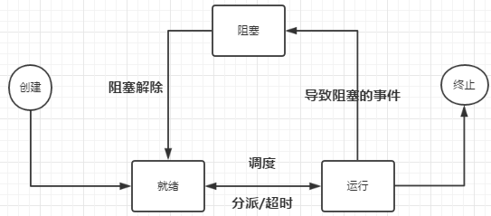

# 进程与线程

## 产生进程背景

在计算机发明之前，人们处理大量的计算是通过人工处理的，耗费人力，成本很大而且错误较多。为了处理大量的数学计算问题，人们发明了计算机。最初的计算机只能接受一些特定的指令，用户输入一个指令，计算机就做出一个操作。当用户在思考或者输入时，计算机就在等待。显然这样效率低下，在很多时候，计算机都处在等待状态。

提高效率方式：**批处理操作体统**

那么能不能把一系列需要操作的指令写下来，形成一个清单，一次性交给计算机，计算机通过不断得读取指令进行相应的操作？就这样，*批处理操作*系统诞生了。用户将多个需要执行的程序写在磁带上，然后交由计算机去读取并逐个执行这些程序，并将输出结果写在另一个磁带上。

批处理操作系统存在的问题：由于批处理系统的指令运行方式是串行的,如果存在这样指令操作顺序：A-B-C，其中A有大量的I/0操作，那么此时B就会进入阻塞转态，值只能等待,这样就浪费了CPU资源(CPU资源很宝贵)。

问题解决方式：通过对AB执行动态切换有效的使用CPU。在A进行IO操作的时候，让CPU去B去,当IO操作结束,让B暂停，再让CPU执行A。通过这样的切换方式实现对CPU资源的高效利用。存在问题：
> 1.内存中始终都只有一个程序在运行，而想要解决上述问题，必然要在内存中装入多个程序，如何处理呢?  
> 2.多个程序使用的数据如何辨别?  
> 3.当一个程序暂停后，随后怎么恢复到它之前执行的状态呢?  

## 程序 进程 线程
* 是什么？
  + 程序：用某种编程语言(java、python等)编写，能够完成一定任务或者功能的代码集合,是指令和数据的有序集合，是**一段静态代码**
  + 进程：是**一个执行中的程序的实例,是程序的执行过程,是程序在内存中的一种映射，是操作系统资源管理的最小单位**。系统的中的每个程序都运行在某个进程的上下文(context)中。上下文是由程序运行所需的状态组成，包括：存放在内部的程序代码、数据、它的栈、通用目的的寄存器内容、程序计数器、环境变量以及打开描述符的集合
  + 线程：线程是能并行运行并且与他们的父进程（创建他们的进程）共享同一地址空间（一段内存区域）和其他资源的轻量级的进程。
> **举例说明**：
对于操作系统来说，一个任务就是一个进程（Process），比如打开一个浏览器就是启动一个浏览器进程，打开一个记事本就启动了一个记事本进程，打开两个记事本就启动了两个记事本进程，打开一个Word就启动了一个Word进程。
有些进程还不止同时干一件事，比如Word，它可以同时进行打字、拼写检查、打印等事情。在一个进程内部，要同时干多件事，就需要同时运行多个“子任务”，我们把进程内的这些“子任务”称为线程（Thread）。
由于每个进程至少要干一件事，所以，一个进程至少有一个线程。当然，像Word这种复杂的进程可以有多个线程，多个线程可以同时执行，多线程的执行方式和多进程是一样的，也是由操作系统在多个线程之间快速切换，让每个线程都短暂地交替运行，看起来就像同时执行一样。当然，真正地同时执行多线程需要多核CPU才可能实现。

## 线程的状态及生命周期(结合图转换，重在理解)

* **新建状态**：(new)线程被创建,但是未申请到资源，比如所需内存
* **就绪状态**：(start)线程做好了一切准备(资源申请),位于**可运行池中**,等待系统调度，获取cpu时间片
* **执行状态**：(run)线程获取到了cpu时间片，进行执行。当一个线程启动后，它不能一直处于运行状态（除非它的线程执行体足够短，瞬间结束），当使用完系统分配的时间后,系统就会剥脱该线程占用的CPU资源，让其他线程获得时间片以执行。**只有处于就绪状态的线程才可能转换到运行状态**
* **阻塞状态**: 等待其他事件发生才能执行,比如执行耗时的I/O读写。
  - **等待阻塞**:运行的线程执行wait()方法，该线程会释放占用的所有资源，JVM会把该线程放入**等待池**中。进入这个状态后，是不能自动唤醒的，必须依靠其他线程调用notify()或notifyAll()方法才能被唤醒。
  - **同步阻塞**:运行的线程在获取对象的同步锁时，若该同步锁被别的线程占用，则JVM会把该线程放入**锁池**中。
  - **其他阻塞**:运行的线程执行sleep()或join()方法，或者发出了I/O请求时，JVM会把该线程置为阻塞状态。当sleep()状态超时、join()等待线程终止或者超时、或者I/O处理完毕时，线程重新转入就绪状态。
  - 当线程试图获取某个对象的同步锁时，如果该锁被其他线程所持有，则当前线程进入阻塞状态，如果想从阻塞状态进入就绪状态必须得获取到其他线程所持有的锁
  - 当线程调用了一个阻塞式的IO方法时，该线程就会进入阻塞状态，如果想进入就绪状态就必须要等到这个阻塞的IO方法返回
  - 当线程调用了某个对象的wait()方法时，也会使线程进入阻塞状态，JVM会把线程放入**等待池**中，必须依靠其他线程调用notify()或notifyAll()方法才能被唤醒
  - 调用了Thread的sleep(long millis)。线程睡眠时间到了会自动进入阻塞状态
  - 一个线程调用了另一个线程的join()方法时，当前线程进入阻塞状态。等新加入的线程运行结束后会结束阻塞状态，进入就绪状态
* **终止状态**：线程的run()方法正常执行完毕或者线程抛出一个未捕获的异常（Exception）、错误（Error），线程就进入死亡状态。一旦进入死亡状态，线程将不再拥有运行的资格，也不能转换为其他状态

## 参考链接 
- [线程的几种状态转换](http://www.cnblogs.com/jijijiefang/articles/7222955.html)
- *[进程和线程的由来与别](https://blog.csdn.net/whl_program/article/details/70217354)
- [进程、线程、多线程相关总结](https://www.cnblogs.com/fuchongjundream/p/3829508.html)
- [进程的概念/标识/结构/状态](https://blog.csdn.net/derkampf/article/details/60477317)
- *[操作系统 - 进程的概念](http://www.cnblogs.com/tianlangshu/p/5224178.html)
- [进程管理笔记一、进程的概念及其产生的背景](https://blog.csdn.net/xd_hebuters/article/details/79590441#一进程产生的背景)
- [上下文切换](http://ifeve.com/context-switch-definition/)
- [进程的概念/标识/结构/状态](https://blog.csdn.net/derkampf/article/details/60477317)
- *[线程的生命周期及状态转换详解](https://blog.csdn.net/asdf_1024/article/details/78978437)
- [进程与线程](https://www.liaoxuefeng.com/wiki/0014316089557264a6b348958f449949df42a6d3a2e542c000/0014319272686365ec7ceaeca33428c914edf8f70cca383000) 
